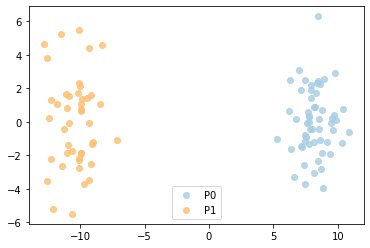
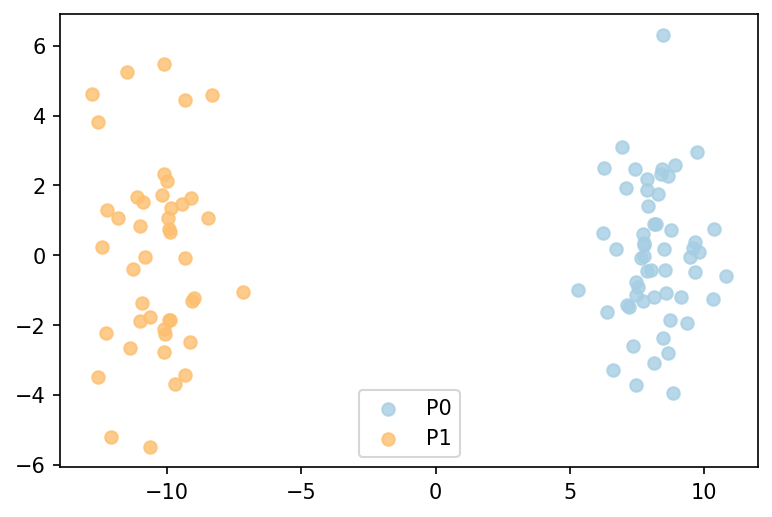
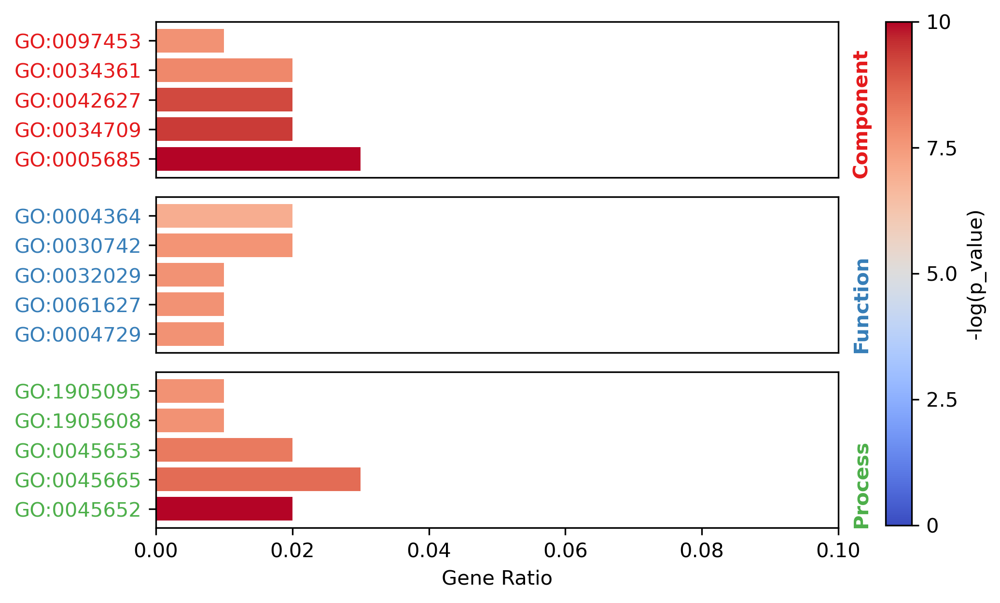

MATTE package Quick Start
=========================

Description
-----------

MATTE (Module Alignment of TranscripTomE) is a python package aiming to
analysis transcriptome from samples with different phenotypes in a
module view. Differiential expression (DE) is commonly used in analysing
transcriptome data. But genes are not work alone, they collaborate.
Network and module based differential methods are developed in recent
years to obtain more information. New problems appears that how to make
sure module or network structure is preserved in all of the phenotypes.
To that end, we proposed MATTE to find the conserved module and diverged
module by treating genes from different phenotypes as individual ones.
By doing so, meaningful markers and modules can be found to better
understand what’s really difference between phenotypes.

**Advantages**

In the first place, MATTE merges the data from phenotypes, seeing genes
from different phenotypes as new analyzing unite. By doing so, benefits
got as follows:

1. MATTE considering the information in phenotypes in the preprocessing
   stage, hoping to find more interesting conclusion.
2. MATTE is actually making transcriptome analysis includes the
   relationship between phenotypes, which is of significance in cancer
   or other complex phenotypes.
3. MATTE can deal with more noise thanks to calculation of relative
   different expression (RDE) and ignore some of batch effect.
4. In a module view, “Markers” can be easily transfer to other case but
   not over fits compare to in a gene view.
5. The result of MATTE can be easily analysed.

Install
-------

Install from pip is recommended.

::

   pip install MATTE

Genes’ Clustering
-----------------

1. Preprocess
2. CLustering
3. Analysis

Pipeline
~~~~~~~~

.. code:: ipython3

    import MATTE
    print(MATTE.__version__)
    ## init with default settings
    pipeline = MATTE.AlignPipe(init=True)
    ## Showing the Pipe composition
    pipeline

.. parsed-literal::

    1.1.1
    

.. parsed-literal::

    MATTE calculation pipeline
    ## STEP 0 	<PipeFunc> inputs_check()
    ## STEP 1 	<PipeFunc> RPKM2TPM()
    ## STEP 2 	<PipeFunc> log2transform()
    ## STEP 3 	<PipeFunc> exp_filter(gene_filter=None)
    ## STEP 4 	<PipeFunc> Kernel_transform(kernel_type='mean',centering_kernel=True,outer_subtract_absolute=True,double_centering=True)
    ## STEP 5 	PCA(n_components=16)
    ## STEP 6 	<PipeFunc> adding_weights()
    ## CLUSTER STEP 0 	<PipeFunc> CrossCluster()
    ## CLUSTER STEP 1 	<PipeFunc> build_results()

.. code:: ipython3

    ## In TenaPipe stores some functions (PipeFunc type)
    pipeline.funcs,pipeline.cluster_func

.. parsed-literal::

    ([<PipeFunc> inputs_check(),
      <PipeFunc> RPKM2TPM(),
      <PipeFunc> log2transform(),
      <PipeFunc> exp_filter(gene_filter=None),
      <PipeFunc> Kernel_transform(kernel_type='mean',centering_kernel=True,outer_subtract_absolute=True,double_centering=True),
      PCA(n_components=16),
      <PipeFunc> adding_weights()],
     [<PipeFunc> CrossCluster(), <PipeFunc> build_results()])

.. code:: ipython3

    ## Running the test.(data is generated randomly)
    R,data = MATTE.package_test(n_genes=1000,pipe=pipeline,verbose=False)

.. code:: ipython3

    # basic usage
    R = pipeline.calculate(df_exp=data['df_exp'],df_pheno=data['df_pheno'])

Inputs
~~~~~~

.. code:: ipython3

    ## Standard inputs
    data['df_exp']

.. raw:: html

    

    
    <table border="1" class="dataframe">
      <thead>
        <tr style="text-align: right;">
          <th></th>
          <th>sample0</th>
          <th>sample3</th>
          <th>sample4</th>
          <th>sample5</th>
          <th>sample8</th>
          <th>sample10</th>
          <th>sample13</th>
          <th>sample14</th>
          <th>sample16</th>
          <th>sample19</th>
          <th>...</th>
          <th>sample86</th>
          <th>sample87</th>
          <th>sample88</th>
          <th>sample90</th>
          <th>sample92</th>
          <th>sample93</th>
          <th>sample95</th>
          <th>sample96</th>
          <th>sample98</th>
          <th>sample99</th>
        </tr>
      </thead>
      <tbody>
        <tr>
          <th>gene0</th>
          <td>2068.782009</td>
          <td>2074.743627</td>
          <td>2358.613186</td>
          <td>2214.779271</td>
          <td>2615.754304</td>
          <td>2416.816078</td>
          <td>2324.006712</td>
          <td>2568.534221</td>
          <td>1790.074733</td>
          <td>2156.944223</td>
          <td>...</td>
          <td>699.020783</td>
          <td>408.182918</td>
          <td>13.719141</td>
          <td>614.162325</td>
          <td>242.881932</td>
          <td>537.560430</td>
          <td>640.396277</td>
          <td>71.989106</td>
          <td>15.671641</td>
          <td>121.134253</td>
        </tr>
        <tr>
          <th>gene1</th>
          <td>1736.262834</td>
          <td>1102.800776</td>
          <td>1202.438027</td>
          <td>1846.884467</td>
          <td>1004.449435</td>
          <td>1161.452514</td>
          <td>1267.909764</td>
          <td>1432.889514</td>
          <td>1176.173534</td>
          <td>633.488180</td>
          <td>...</td>
          <td>1426.345172</td>
          <td>1447.027209</td>
          <td>1606.243963</td>
          <td>2253.905879</td>
          <td>1643.103867</td>
          <td>2278.306248</td>
          <td>1456.288578</td>
          <td>2015.417148</td>
          <td>1947.948739</td>
          <td>1425.494850</td>
        </tr>
        <tr>
          <th>gene2</th>
          <td>2014.528625</td>
          <td>2398.080280</td>
          <td>1944.729892</td>
          <td>2316.274409</td>
          <td>2131.565037</td>
          <td>2298.541242</td>
          <td>2531.612209</td>
          <td>2596.111747</td>
          <td>2413.634703</td>
          <td>2207.004282</td>
          <td>...</td>
          <td>805.591423</td>
          <td>937.059757</td>
          <td>811.347534</td>
          <td>819.525380</td>
          <td>617.231009</td>
          <td>660.709923</td>
          <td>652.394533</td>
          <td>823.183763</td>
          <td>890.001682</td>
          <td>982.703612</td>
        </tr>
        <tr>
          <th>gene3</th>
          <td>659.427115</td>
          <td>163.787569</td>
          <td>561.642612</td>
          <td>378.384480</td>
          <td>519.343153</td>
          <td>19.082749</td>
          <td>847.503441</td>
          <td>381.925232</td>
          <td>707.469305</td>
          <td>276.173993</td>
          <td>...</td>
          <td>1487.512143</td>
          <td>1086.595268</td>
          <td>315.433694</td>
          <td>1820.512500</td>
          <td>1701.598813</td>
          <td>1402.320642</td>
          <td>1623.801592</td>
          <td>1282.006193</td>
          <td>1237.460095</td>
          <td>862.684200</td>
        </tr>
        <tr>
          <th>gene4</th>
          <td>557.430594</td>
          <td>391.416889</td>
          <td>842.972964</td>
          <td>675.541378</td>
          <td>850.962173</td>
          <td>811.020469</td>
          <td>986.334022</td>
          <td>1345.391218</td>
          <td>1264.336918</td>
          <td>1136.040696</td>
          <td>...</td>
          <td>492.540540</td>
          <td>1170.198803</td>
          <td>637.125151</td>
          <td>83.639511</td>
          <td>846.553239</td>
          <td>718.903346</td>
          <td>285.646841</td>
          <td>68.010063</td>
          <td>426.350989</td>
          <td>523.634085</td>
        </tr>
        <tr>
          <th>...</th>
          <td>...</td>
          <td>...</td>
          <td>...</td>
          <td>...</td>
          <td>...</td>
          <td>...</td>
          <td>...</td>
          <td>...</td>
          <td>...</td>
          <td>...</td>
          <td>...</td>
          <td>...</td>
          <td>...</td>
          <td>...</td>
          <td>...</td>
          <td>...</td>
          <td>...</td>
          <td>...</td>
          <td>...</td>
          <td>...</td>
          <td>...</td>
        </tr>
        <tr>
          <th>gene995</th>
          <td>1079.554741</td>
          <td>1256.576785</td>
          <td>371.790347</td>
          <td>1552.897702</td>
          <td>837.588520</td>
          <td>781.422702</td>
          <td>1410.911788</td>
          <td>280.789440</td>
          <td>1074.169879</td>
          <td>891.334274</td>
          <td>...</td>
          <td>914.248736</td>
          <td>1039.659511</td>
          <td>1424.090367</td>
          <td>1528.602309</td>
          <td>1048.966685</td>
          <td>1217.551321</td>
          <td>1595.634636</td>
          <td>892.179251</td>
          <td>733.385461</td>
          <td>1326.974023</td>
        </tr>
        <tr>
          <th>gene996</th>
          <td>1466.756618</td>
          <td>682.381925</td>
          <td>655.547941</td>
          <td>1217.328283</td>
          <td>1027.033929</td>
          <td>743.552669</td>
          <td>1303.702866</td>
          <td>156.088532</td>
          <td>1100.372258</td>
          <td>1653.174072</td>
          <td>...</td>
          <td>171.781193</td>
          <td>409.069384</td>
          <td>1064.053578</td>
          <td>409.015074</td>
          <td>1108.110725</td>
          <td>522.949709</td>
          <td>1141.158675</td>
          <td>807.635314</td>
          <td>650.720516</td>
          <td>935.940121</td>
        </tr>
        <tr>
          <th>gene997</th>
          <td>2667.592315</td>
          <td>2705.673085</td>
          <td>2692.679566</td>
          <td>2451.598273</td>
          <td>2265.107811</td>
          <td>1688.030061</td>
          <td>3214.672455</td>
          <td>2487.450931</td>
          <td>3213.472788</td>
          <td>1963.800244</td>
          <td>...</td>
          <td>2788.161130</td>
          <td>2177.646822</td>
          <td>1659.035894</td>
          <td>1952.969200</td>
          <td>2790.787782</td>
          <td>2053.803419</td>
          <td>2259.536840</td>
          <td>2437.241921</td>
          <td>1967.708017</td>
          <td>2296.309486</td>
        </tr>
        <tr>
          <th>gene998</th>
          <td>201.558856</td>
          <td>400.279793</td>
          <td>812.383524</td>
          <td>262.929812</td>
          <td>671.040851</td>
          <td>580.943332</td>
          <td>343.901157</td>
          <td>476.913661</td>
          <td>667.557218</td>
          <td>168.932862</td>
          <td>...</td>
          <td>621.693365</td>
          <td>832.883736</td>
          <td>1035.085086</td>
          <td>512.018102</td>
          <td>722.357924</td>
          <td>507.593183</td>
          <td>608.552576</td>
          <td>169.301006</td>
          <td>612.163599</td>
          <td>186.982519</td>
        </tr>
        <tr>
          <th>gene999</th>
          <td>1407.004628</td>
          <td>1603.523673</td>
          <td>1292.689612</td>
          <td>1675.310108</td>
          <td>1112.094279</td>
          <td>907.000656</td>
          <td>741.737107</td>
          <td>720.647700</td>
          <td>1740.447591</td>
          <td>844.582854</td>
          <td>...</td>
          <td>1109.305059</td>
          <td>1289.918539</td>
          <td>1080.680714</td>
          <td>1104.604265</td>
          <td>224.328929</td>
          <td>1545.090453</td>
          <td>1048.014265</td>
          <td>1194.242678</td>
          <td>2064.968748</td>
          <td>1023.087880</td>
        </tr>
      </tbody>
    </table>
    
1000 rows × 100 columns

    

.. code:: ipython3

    data['df_pheno']

.. parsed-literal::

    sample0     P0
    sample1     P1
    sample2     P1
    sample3     P0
    sample4     P0
                ..
    sample95    P1
    sample96    P1
    sample97    P0
    sample98    P1
    sample99    P1
    Length: 100, dtype: object

Clustering Results
~~~~~~~~~~~~~~~~~~

.. code:: ipython3

    R.cluster_properties

.. parsed-literal::

    {'error': 23.744632494143193,
     'method': 'kmeans_a',
     'dist_type': 'a',
     'n_clusters': 8,
     'npass': 20,
     'score': 5099.612952032368,
     'Process': "MATTE calculation pipeline\n## STEP 0 \t<PipeFunc> inputs_check()\n## STEP 1 \t<PipeFunc> RPKM2TPM()\n## STEP 2 \t<PipeFunc> log2transform()\n## STEP 3 \t<PipeFunc> exp_filter(gene_filter=None)\n## STEP 4 \t<PipeFunc> Kernel_transform(kernel_type='mean',centering_kernel=True,outer_subtract_absolute=True,double_centering=True)\n## STEP 5 \tPCA(n_components=16)\n## STEP 6 \t<PipeFunc> adding_weights()\n## CLUSTER STEP 0 \t<PipeFunc> CrossCluster()\n## CLUSTER STEP 1 \t<PipeFunc> build_results()\n"}

.. code:: ipython3

    R.res

.. raw:: html

    

    
    <table border="1" class="dataframe">
      <thead>
        <tr style="text-align: right;">
          <th></th>
          <th>P0</th>
          <th>P1</th>
          <th>matched</th>
        </tr>
      </thead>
      <tbody>
        <tr>
          <th>gene0</th>
          <td>3</td>
          <td>4</td>
          <td>False</td>
        </tr>
        <tr>
          <th>gene1</th>
          <td>0</td>
          <td>3</td>
          <td>False</td>
        </tr>
        <tr>
          <th>gene2</th>
          <td>3</td>
          <td>7</td>
          <td>False</td>
        </tr>
        <tr>
          <th>gene3</th>
          <td>4</td>
          <td>0</td>
          <td>False</td>
        </tr>
        <tr>
          <th>gene4</th>
          <td>1</td>
          <td>4</td>
          <td>False</td>
        </tr>
        <tr>
          <th>...</th>
          <td>...</td>
          <td>...</td>
          <td>...</td>
        </tr>
        <tr>
          <th>gene995</th>
          <td>0</td>
          <td>0</td>
          <td>True</td>
        </tr>
        <tr>
          <th>gene996</th>
          <td>6</td>
          <td>2</td>
          <td>False</td>
        </tr>
        <tr>
          <th>gene997</th>
          <td>3</td>
          <td>3</td>
          <td>True</td>
        </tr>
        <tr>
          <th>gene998</th>
          <td>5</td>
          <td>7</td>
          <td>False</td>
        </tr>
        <tr>
          <th>gene999</th>
          <td>0</td>
          <td>0</td>
          <td>True</td>
        </tr>
      </tbody>
    </table>
    
1000 rows × 3 columns

    

.. code:: ipython3

    from MATTE.analysis import Fig_SampleFeature
    sf = R.SampleFeature()
    f = Fig_SampleFeature(sf,R.pheno)

.. code:: ipython3

    R.ModuleSNR(sf)[0:5]

.. parsed-literal::

    M3.4_0    5.639699
    M4.3_0    4.175571
    M0.3_0    3.417767
    M3.7_0    3.283632
    M5.3_0    3.222075
    dtype: float64

Embedder
--------

Embedder is a buildin class that select key genes or embed data by
module calculation.

In this step, multiple phenotypes can be received.

.. code:: ipython3

    from MATTE import ModuleEmbedder
    embedder = ModuleEmbedder(pipeline=pipeline)

.. code:: ipython3

    gene_rank = embedder.gene_rank(X = data['df_exp'].T, y=data['df_pheno'])
    gene_rank

.. parsed-literal::

    round 0: P0 vs P1: 100%|██████████| 1/1 [00:01<00:00,  1.34s/it]
    

.. parsed-literal::

    There are 2 labels: ['P0' 'P1']
    

.. parsed-literal::

    gene0      14.136113
    gene1       6.884732
    gene2       7.687132
    gene3       6.754049
    gene4       2.986378
                 ...    
    gene995     0.099898
    gene996     0.000000
    gene997     0.000000
    gene998     0.095282
    gene999     0.099898
    Length: 1000, dtype: float64

Module Analysis
---------------

.. code:: ipython3

    from TENA.analysis import Fig_SampleFeature
    
    # Showing the Summary.
    R.summary()
    # two figures can be get by following:
    if False:
        f1 = R.Vis_Jmat() # genes' distribution
        # Showing the samples' distribution
        
        sf = R.SampleFeature()
        f = Fig_SampleFeature(sf,labels=R.pheno,dpi=300,model=PCA())

.. parsed-literal::

    # --- Number of genes:
    Same Module Genes: 613
    Different Module Genes: 387
    # --- clustering score:
    error 23.68317251501341
    method kmeans_a
    dist_type a
    n_clusters 8
    npass 20
    score 9367.940233968568
    Process MATTE calculation pipeline
    ## STEP 0 	<PipeFunc> inputs_check()
    ## STEP 1 	<PipeFunc> RPKM2TPM()
    ## STEP 2 	<PipeFunc> log2transform()
    ## STEP 3 	<PipeFunc> exp_filter(gene_filter=None)
    ## STEP 4 	<PipeFunc> Kernel_transform(kernel_type='mean',centering_kernel=True,outer_subtract_absolute=True,double_centering=True)
    ## STEP 5 	PCA(n_components=16)
    ## STEP 6 	<PipeFunc> adding_weights()
    ## CLUSTER STEP 0 	<PipeFunc> CrossCluster()
    ## CLUSTER STEP 1 	<PipeFunc> build_results()
    
    # --- samples' distribution:
    

Function Analysis
~~~~~~~~~~~~~~~~~

Read go annote files. File can be downloaded from
https://ftp.ncbi.nih.gov/gene/DATA/

.. code:: ipython3

    import pandas as pd
    annote_file = pd.read_table("A:/Data/Annotation/gene2go")
    annote_file = annote_file[annote_file["#tax_id"] == 9606]
    def lst_change(lst,target,changed):
        ret = []
        for i in lst:
            if i == target:
                ret.append(changed)
            else:
                ret.append(i)
        return ret
    ## Change columns name.
    annote_file.columns = lst_change(annote_file.columns,"GO_term","Term")
    annote_file.columns = lst_change(annote_file.columns,"GO_ID","Term_ID")

.. code:: ipython3

    ## randomly select some genes
    import numpy as np
    from random import sample
    unique_genes = np.unique(annote_file['GeneID'].values)
    selected_genes = sample(unique_genes.tolist(),100)

The format of input files are following:

::

   gene_set     iteral object, containing gene id.
   annote_file  with columns ["Term_ID","GeneID","Term","Category"],and each row is an entry.

.. code:: ipython3

    annote_file

.. raw:: html

    

    
    <table border="1" class="dataframe">
      <thead>
        <tr style="text-align: right;">
          <th></th>
          <th>#tax_id</th>
          <th>GeneID</th>
          <th>Term_ID</th>
          <th>Evidence</th>
          <th>Qualifier</th>
          <th>Term</th>
          <th>PubMed</th>
          <th>Category</th>
        </tr>
      </thead>
      <tbody>
        <tr>
          <th>640889</th>
          <td>9606</td>
          <td>1</td>
          <td>GO:0003674</td>
          <td>ND</td>
          <td>enables</td>
          <td>molecular_function</td>
          <td>-</td>
          <td>Function</td>
        </tr>
        <tr>
          <th>640890</th>
          <td>9606</td>
          <td>1</td>
          <td>GO:0005576</td>
          <td>HDA</td>
          <td>located_in</td>
          <td>extracellular region</td>
          <td>27068509</td>
          <td>Component</td>
        </tr>
        <tr>
          <th>640891</th>
          <td>9606</td>
          <td>1</td>
          <td>GO:0005576</td>
          <td>IDA</td>
          <td>located_in</td>
          <td>extracellular region</td>
          <td>3458201</td>
          <td>Component</td>
        </tr>
        <tr>
          <th>640892</th>
          <td>9606</td>
          <td>1</td>
          <td>GO:0005576</td>
          <td>TAS</td>
          <td>located_in</td>
          <td>extracellular region</td>
          <td>-</td>
          <td>Component</td>
        </tr>
        <tr>
          <th>640893</th>
          <td>9606</td>
          <td>1</td>
          <td>GO:0005615</td>
          <td>HDA</td>
          <td>located_in</td>
          <td>extracellular space</td>
          <td>16502470</td>
          <td>Component</td>
        </tr>
        <tr>
          <th>...</th>
          <td>...</td>
          <td>...</td>
          <td>...</td>
          <td>...</td>
          <td>...</td>
          <td>...</td>
          <td>...</td>
          <td>...</td>
        </tr>
        <tr>
          <th>971204</th>
          <td>9606</td>
          <td>118568804</td>
          <td>GO:0004930</td>
          <td>IEA</td>
          <td>enables</td>
          <td>G protein-coupled receptor activity</td>
          <td>-</td>
          <td>Function</td>
        </tr>
        <tr>
          <th>971205</th>
          <td>9606</td>
          <td>118568804</td>
          <td>GO:0004984</td>
          <td>IEA</td>
          <td>enables</td>
          <td>olfactory receptor activity</td>
          <td>-</td>
          <td>Function</td>
        </tr>
        <tr>
          <th>971206</th>
          <td>9606</td>
          <td>118568804</td>
          <td>GO:0007186</td>
          <td>IEA</td>
          <td>involved_in</td>
          <td>G protein-coupled receptor signaling pathway</td>
          <td>-</td>
          <td>Process</td>
        </tr>
        <tr>
          <th>971207</th>
          <td>9606</td>
          <td>118568804</td>
          <td>GO:0016021</td>
          <td>IEA</td>
          <td>located_in</td>
          <td>integral component of membrane</td>
          <td>-</td>
          <td>Component</td>
        </tr>
        <tr>
          <th>971208</th>
          <td>9606</td>
          <td>118568804</td>
          <td>GO:0050911</td>
          <td>IEA</td>
          <td>involved_in</td>
          <td>detection of chemical stimulus involved in sen...</td>
          <td>-</td>
          <td>Process</td>
        </tr>
      </tbody>
    </table>
    
330320 rows × 8 columns

    

.. code:: ipython3

    from TENA.analysis import FunctionEnrich
    all_items,term_genes = FunctionEnrich(annote_file,selected_genes)

.. parsed-literal::

    100%|██████████| 18684/18684 [02:06<00:00, 147.40it/s]
    

The function FunctionEnrich return two object:

::

   all_item    Terms with p_value, fdr and other information
   term_genes  each term enriches what genes

.. code:: ipython3

    ## Filtering the enriched results
    target = all_items.groupby(by="Category").apply(lambda x: x.sort_values(by="p_value").iloc[0:5,:])
    target.index= [i[1] for i in target.index]
    target

.. raw:: html

    

    
    <table border="1" class="dataframe">
      <thead>
        <tr style="text-align: right;">
          <th></th>
          <th>Term</th>
          <th>Category</th>
          <th>n_enriched</th>
          <th>n_backgroud</th>
          <th>p_value</th>
          <th>fdr</th>
          <th>gene_ratio</th>
        </tr>
      </thead>
      <tbody>
        <tr>
          <th>GO:0005685</th>
          <td>U1 snRNP</td>
          <td>Component</td>
          <td>3</td>
          <td>33</td>
          <td>0.000538</td>
          <td>0.94667</td>
          <td>0.03</td>
        </tr>
        <tr>
          <th>GO:0034709</th>
          <td>methylosome</td>
          <td>Component</td>
          <td>2</td>
          <td>12</td>
          <td>0.001479</td>
          <td>1.0</td>
          <td>0.02</td>
        </tr>
        <tr>
          <th>GO:0042627</th>
          <td>chylomicron</td>
          <td>Component</td>
          <td>2</td>
          <td>13</td>
          <td>0.001743</td>
          <td>1.0</td>
          <td>0.02</td>
        </tr>
        <tr>
          <th>GO:0034361</th>
          <td>very-low-density lipoprotein particle</td>
          <td>Component</td>
          <td>2</td>
          <td>20</td>
          <td>0.004153</td>
          <td>1.0</td>
          <td>0.02</td>
        </tr>
        <tr>
          <th>GO:0097453</th>
          <td>mesaxon</td>
          <td>Component</td>
          <td>1</td>
          <td>1</td>
          <td>0.004834</td>
          <td>1.0</td>
          <td>0.01</td>
        </tr>
        <tr>
          <th>GO:0004729</th>
          <td>oxygen-dependent protoporphyrinogen oxidase ac...</td>
          <td>Function</td>
          <td>1</td>
          <td>1</td>
          <td>0.004834</td>
          <td>1.0</td>
          <td>0.01</td>
        </tr>
        <tr>
          <th>GO:0061627</th>
          <td>S-methylmethionine-homocysteine S-methyltransf...</td>
          <td>Function</td>
          <td>1</td>
          <td>1</td>
          <td>0.004834</td>
          <td>1.0</td>
          <td>0.01</td>
        </tr>
        <tr>
          <th>GO:0032029</th>
          <td>myosin tail binding</td>
          <td>Function</td>
          <td>1</td>
          <td>1</td>
          <td>0.004834</td>
          <td>1.0</td>
          <td>0.01</td>
        </tr>
        <tr>
          <th>GO:0030742</th>
          <td>GTP-dependent protein binding</td>
          <td>Function</td>
          <td>2</td>
          <td>22</td>
          <td>0.005018</td>
          <td>1.0</td>
          <td>0.02</td>
        </tr>
        <tr>
          <th>GO:0004364</th>
          <td>glutathione transferase activity</td>
          <td>Function</td>
          <td>2</td>
          <td>28</td>
          <td>0.008057</td>
          <td>1.0</td>
          <td>0.02</td>
        </tr>
        <tr>
          <th>GO:0045652</th>
          <td>regulation of megakaryocyte differentiation</td>
          <td>Process</td>
          <td>2</td>
          <td>8</td>
          <td>0.000636</td>
          <td>1.0</td>
          <td>0.02</td>
        </tr>
        <tr>
          <th>GO:0045665</th>
          <td>negative regulation of neuron differentiation</td>
          <td>Process</td>
          <td>3</td>
          <td>58</td>
          <td>0.002789</td>
          <td>1.0</td>
          <td>0.03</td>
        </tr>
        <tr>
          <th>GO:0045653</th>
          <td>negative regulation of megakaryocyte different...</td>
          <td>Process</td>
          <td>2</td>
          <td>18</td>
          <td>0.003365</td>
          <td>1.0</td>
          <td>0.02</td>
        </tr>
        <tr>
          <th>GO:1905608</th>
          <td>positive regulation of presynapse assembly</td>
          <td>Process</td>
          <td>1</td>
          <td>1</td>
          <td>0.004834</td>
          <td>1.0</td>
          <td>0.01</td>
        </tr>
        <tr>
          <th>GO:1905095</th>
          <td>negative regulation of apolipoprotein A-I-medi...</td>
          <td>Process</td>
          <td>1</td>
          <td>1</td>
          <td>0.004834</td>
          <td>1.0</td>
          <td>0.01</td>
        </tr>
      </tbody>
    </table>
    

.. code:: ipython3

    from TENA.analysis import Fig_Fuction
    f = Fig_Fuction(target,"p_value",dpi=300)

