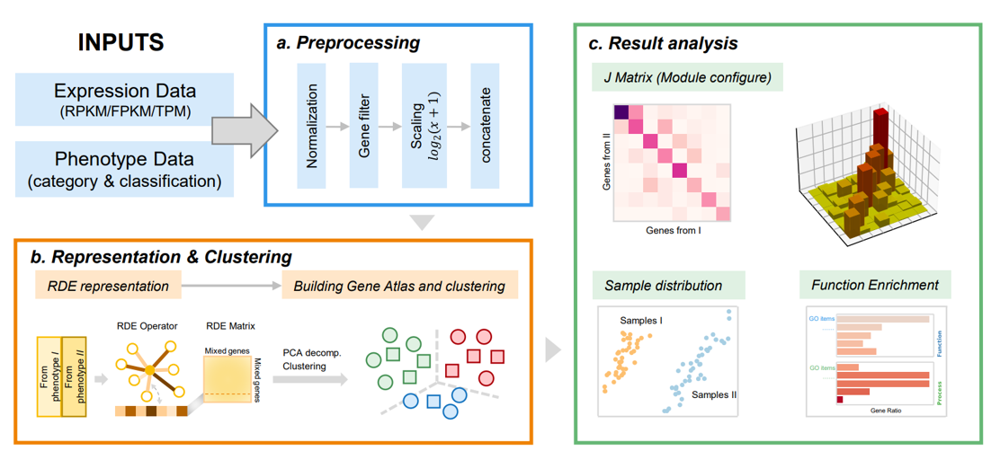
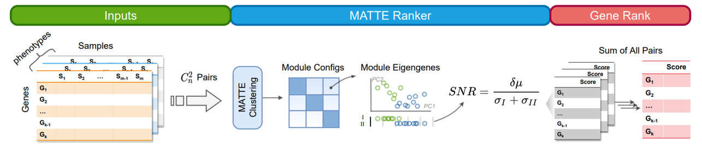

User Guide
================

The user guide will talk about how the pipeline is implemented and how
to modified pipeline or setup a custom pipeline.

Overview of MATTE
-----------------

|image.png| |image-2.png|

Gene clustering process
-----------------------

Broadly speaking, there are three steps:

1. preprocessing
2. clustering
3. Module analysis

The results that each of these parameters can lead to and produce will
be described in detail in the following three procedures.

Pipeline design
~~~~~~~~~~~~~~~

``PipeFunc`` is a most basic class in MATTE python package. The class
store a function and it’s arguments but **not run it** until calling it
like calling a funtion. And a ``Pipefunc`` will show it’s arguments and
name by ``print(PipeFunc)`` or ``str(PipeFunc)``. The string will be
updated everytime parameters are added by ``add_params``, but not when
being called. When you call it, stored arguments can be ellipsised. But
arguments you put in will also be considered.

In a ``AlignPipe`` class, there are several ``PipeFunc`` and
``transformer``. Here, ``transformer`` means object that has ``fit`` and
``transform`` methods. When calling ``AlignPipe.calculate``,
``PipeFunc`` and ``transformer`` will be performed one by one. All
``funcs`` are stored in ``AlignPipe.funcs`` attributes and
``AlignPipe.cluster_func`` attributes. One can use build-in function
``add_steps`` to add a **preprocessing** step into ``AlignPipe.funcs``
and ``set_cluster_method`` to add **clustering** step into
``AlignPipe.cluster_func``. These two are ``list`` object that store
``PipeFunc`` and ``transformer``. You can also add parameters by
``add_param``, (in this step, a new function that return a dict contain
param value and name will be generated) add transformer by
``add_transformer``. When you create a ``AlignPipe`` object, by setting
``init=True``, default pipeline will be created. *All functions in the
pipeline should return a dict object*,(all these returns are saved in a
dict ``temp_result``) and by this way its return will be record and use
in the following functions.

There are four methods to run pipeline, ``calculate`` and
``fit_transform`` is the same, but ``fit_transform`` has a parameters
that allow save temp result. The saved temp dict object can be used in
``calculate_from_temp``, where only clustering functions will be
performed. And ``transform`` will not fit the data but use fitted
transformers in the pipeline. If you want to use attributes of
transformers, use ``get_attribute_from_transformer``.

Some key temps are following: \* When running the pipeline, before
clustering there should generate a object named “before_clustering_df”
to used in the ``cluster_fun``. \* And in the preprocessing steps,
return object named “df_exp” to corver input. \* When using
``CrossCluster`` object to perform clustering, ``cluster_label`` and
``cluster_properties`` will be passed to ``build_results`` \* And
``build_results`` will return a object named ``Result``.

For convenience, a decorator ``utils.kw_decorator`` is used in most of
functions in pipeline. It makes a fucntion return a dict according to
parameter ``kw``\ (str or list), and **the function will accept
additional parameters** but not raise error.

Preprocessing
~~~~~~~~~~~~~

Key function in preprocessing is ``Kernel_transform``, who perform
mostly important relative differential expression. Some kernel transform
is implemented: ‘meanrbf’,‘meanlocalrbf’,‘mean’,‘median’,‘medianrbf’ and
‘medianlocalrbf’. For normal, mean kernels is recommended, but with
outliers median function may have a better performance. ``rbf`` related
kernels performs a variant Gauss kernel transformation after RDE, and in
the ``localrbf`` kernel, each genes’ gamma is depended on it’s nearest K
neibors’ distance. A function is also accept to ``kernel_type``
parameter. And this function should be performed in two vector, (it
should be acctepted by ``scipy.spatial.distance.cdist``). But if the
funtion is of great complexities, it can cost much time for this step
will performed to each gene in the each phenotype. After kernel matrix
calculation, a ``double_centering`` and
``sklearn.preprocessing.KernelCenterer`` will be performed by default.
In the previous test, these two will make results get more score, but
may change in your case.

Other functions’ detail can be seen in API page, ``exp_filter`` filter
out genes with extremely low expression(custom function is allowed too),
and ``RPKM2TPM`` is an important normalization preprocessing steps.
Keeping default preprocessing steps is highly recommended.

Clustering
~~~~~~~~~~

``CrossCluster`` is clustering function or clusterer warpper. There are three pre-implemented methods: ``kmeans`` (wrapper from ``Bio.Cluster.kclust``), ``spectrum`` and ``spectral_bicluster`` (wrapper from ``sklearn`` implemention). So other keywords parameters should seen in the original implemention. In spectrum clustering, by default will calculate distance matrix first(parameter ``use_aff``). If not using preset implemention, by ``build_from_func`` or ``build_from_model`` to set up clustering methods.

Gene Ranker
-----------

GeneRanker accept more than two phenotypes, and will use pipeline to
calculate pairs of phenotypes one by one, fincally sum/concatenate the
results. Inputs of ModuleEmbedder is not the same as pipeline. Row of
Expression data is sample, column is gene.

There are two types of ranking :

There are several types of GeneRanker: 1. ‘module’ and ‘gene’

will cluster genes according to their expression. And Use module SNR to
rank genes. In gene mode, the SNR will be corrected by the correlation
of gene expression and module eigen.

2. ‘dist’,‘cross-dist’.

In dist mode, the distance of each genes will be calculated. And genes
will be ranked according to the sum of distance to each other genes. In
cross-dist mode, the distance of differential expression and
differential co-expression will be merged.
